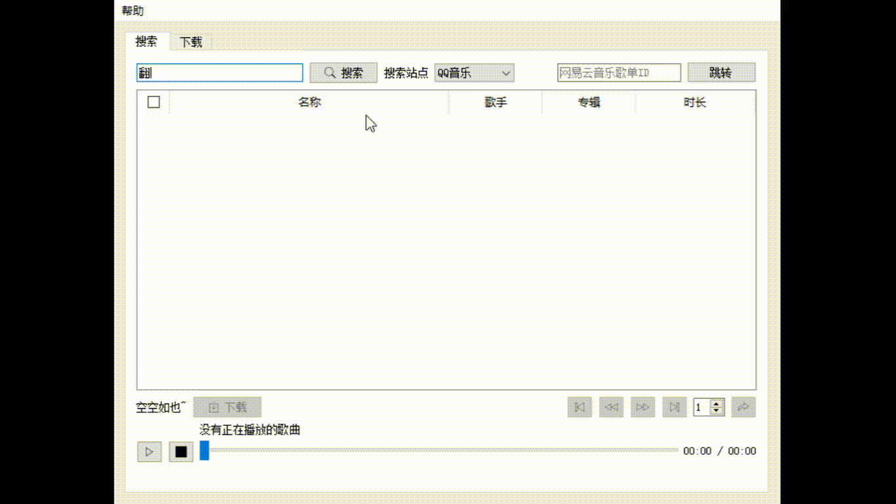

# MusicDownloader

音乐下载工具，目前支持网易云音乐、QQ音乐。仅供学习研究使用。

## 功能

- 搜索关键词，返回支持站点的歌曲列表。
- 根据 ID 获取网易云音乐歌单。
- 过滤不能播放的歌曲（灰色）
- 下载、播放列表中的歌曲，如果有歌词，默认一起下载。

## 预览



## 依赖

- PyQt5
- requests
- bs4
- Crypto（网易云音乐）

## 运行

```shell
python main.py
```

## 注意事项

- 播放 QQ 音乐的歌曲需要安装 [LAVFilters](https://github.com/Nevcairiel/LAVFilters/releases)
- 音质为不登录时的普通音质
- 本代码不直接提供下载

## 总结

[判断网页端QQ音乐及网易云音乐歌曲能否播放](https://wwwpf.github.io/2019/02/07/判断网页端QQ音乐及网易云音乐歌曲能否播放/)

## 参考

[网易云音乐歌单详情列表爬虫破解](https://blog.csdn.net/Deadeyehui/article/details/80708625)

[图标](https://www.iconfinder.com/iconsets/ionicons)
